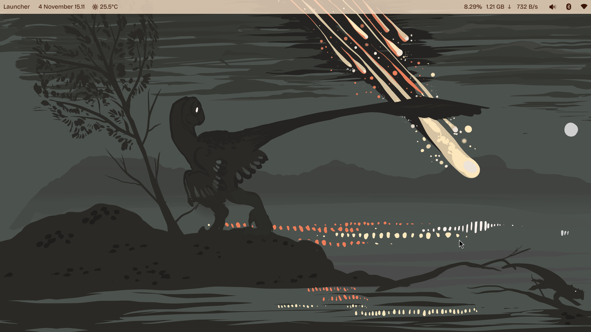
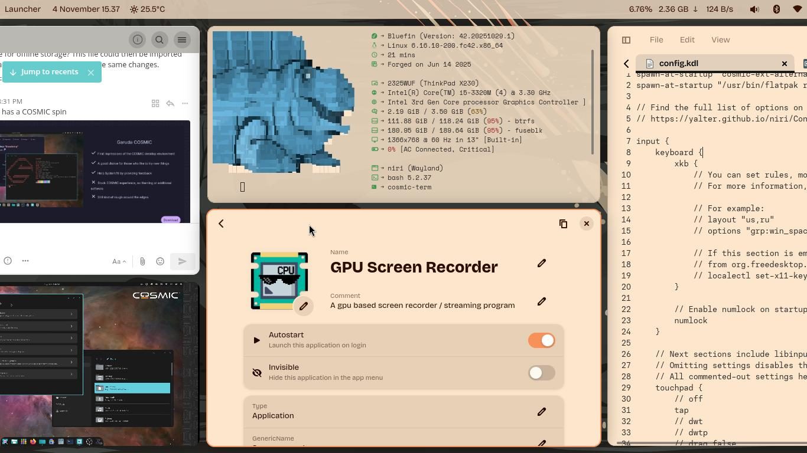

# cosmoneer

A proof-of-concept to bring COSMIC + Niri + Bluefin goodies together into a scroller desktop OS. Sane defaults from Universal Blue with System76's COSMIC desktop environment, the Niri scrollable tiling compositor, and Docker group access.

Try it:
- Install a Fedora Atomic variant, like [Bluefin](https://projectbluefin.io)
- Run `sudo bootc switch ghcr.io/kikaraage/cosmoneer`
- **COSMIC + Niri Integration:** After your first login, run `ujust configure-niri-cosmic` to configure COSMIC apps and keybindings inside Niri. Use `ujust show-niri-config` to review the configuration or `ujust reset-niri-config` to roll back to defaults.

## About This Image

This image is based on **Bluefin stable** and includes these customizations:

### Desktop Environment
- **COSMIC Desktop** - System76's next-generation desktop environment built in Rust ([ryanabx/cosmic-epoch](https://copr.fedorainfracloud.org/coprs/ryanabx/cosmic-epoch/))
- **Niri Window Manager** - Scrollable-tiling Wayland compositor ([yalter/niri-git](https://copr.fedorainfracloud.org/coprs/yalter/niri-git/))
- **COSMIC-Niri Integration** - Run COSMIC apps in Niri via cosmic-ext-alternative-startup
- **Dynamic Background Themes** - Automatic palette generation from wallpapers via cosmic-ext-bg-theme
- **Fonts preinstalled via Brew** - Recommended Cosmic UI font: Work Sans, Bricolage Grotesque, Aptos

### Multimedia Support
- FFmpeg with full codec support
- GStreamer plugins (good, base, bad-free)
- Video thumbnail support for file managers
- LAME audio codecs
- Modern image format support (libjxl)

### Developer Tools
- **Docker CE** - Latest Docker Engine with docker-compose plugin
- **Additional Fonts** - JetBrains Mono, Fira Code and more
- SSH agent enabled globally
- Docker group pre-configured

### Added Applications
- **GPU Screen Recorder** - Efficient screen recording with hardware acceleration
- COSMIC Terminal (cosmic-term) included with COSMIC desktop

### ujust Commands
- `ujust configure-niri-cosmic` - Configure Niri for COSMIC integration
- `ujust show-niri-config` - Display current Niri configuration
- `ujust reset-niri-config` - Reset Niri to defaults
- `ujust configure-dev-groups` - Add user to docker and libvirt groups

*Last updated: 2024-11-03*

## Community

- [Universal Blue Forums](https://universal-blue.discourse.group/)
- [Universal Blue Discord](https://discord.gg/WEu6BdFEtp)
- [bootc Discussion](https://github.com/bootc-dev/bootc/discussions)
- I personally hang out on [Origami Linux Discord server](https://discord.com/channels/1434166231274885313/1434166233816764529), a fellow COSMIC-based image. [Check Origami Linux repository](https://github.com/john-holt4/Origami-Linux) too!

## Learn More

- [Universal Blue Documentation](https://universal-blue.org/)
- [bootc Documentation](https://containers.github.io/bootc/)
- [Video Tutorial by TesterTech](https://www.youtube.com/watch?v=IxBl11Zmq5wE)